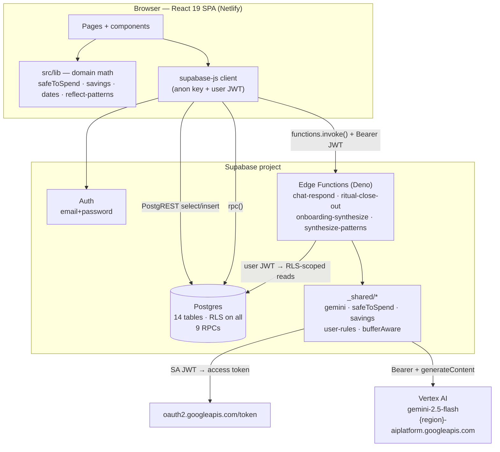
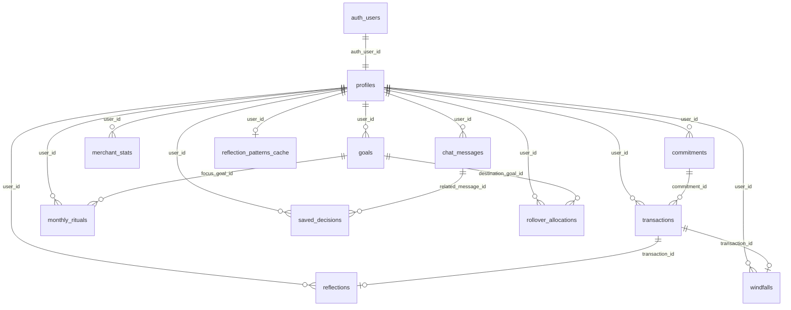
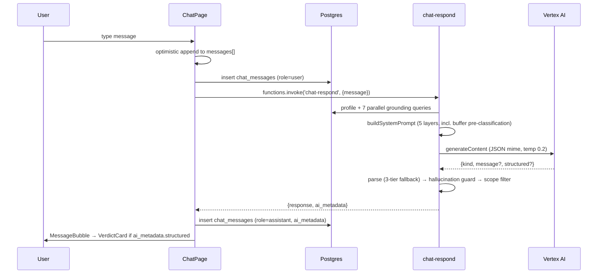

# Savio — Architecture

> Engineering reference for the Savio codebase. Describes what exists on disk today, how the
> pieces fit, and which constraints are load-bearing. Product rationale lives in
> [PM_DECISIONS.md](./PM_DECISIONS.md); agent working instructions live in [CLAUDE.md](./CLAUDE.md);
> deferred scope lives in [docs/v2-inventory.md](./docs/v2-inventory.md).

**Audience:** anyone (human or agent) about to change code here.
**Status at time of writing:** Phase 3 complete + post-tag streams `0.5o`–`0.5z`. 22 migrations, 6 Edge Functions, 6 routes + 9 flow routes.

---

## 1. System overview

Savio is a single-page React app talking to a Supabase project. There is no bespoke
application server: the browser holds a user JWT, hits Postgres directly through PostgREST
(guarded by RLS), calls Postgres functions for multi-row transactional writes, and calls Deno
Edge Functions for anything that needs a secret or an LLM.



**Trust model.** The browser only ever holds the anon key plus the signed-in user's JWT. Edge
Functions construct their Supabase client *from the caller's `Authorization` header*, so RLS —
not application code — is what isolates data. The service role key exists only in local scripts
(`scripts/apply-migrations.js`, `scripts/test-chat-7cases.mjs`) and in one legacy stub function
(§6.6). Vertex AI credentials never leave the Edge runtime.

**Deployment topology.** Frontend → Netlify (SPA rewrite via [public/_redirects](public/_redirects)).
Everything else → Supabase (managed Postgres + Deno Deploy-backed Edge runtime). No containers, no
queues, no cache tier other than one Postgres table (§4.3).

---

## 2. Tech stack

| Layer | Choice | Notes |
|---|---|---|
| UI | React 19.2, TypeScript ~6.0, Vite 8 | `strict`, `noUnusedLocals`, `noUnusedParameters` all on |
| Routing | react-router-dom 7 (`BrowserRouter`) | flat route table, no nested layouts |
| Styling | Tailwind 3.4 + custom token layer | [tailwind.config.ts](tailwind.config.ts) + [src/lib/design-tokens.ts](src/lib/design-tokens.ts) |
| Components | shadcn/ui (Radix primitives) under [src/components/ui/](src/components/ui/) | plus a hand-rolled 4-piece primitive set (§3.4) |
| Icons | lucide-react | |
| Forms | react-hook-form + zod + @hookform/resolvers | present; used sparingly |
| State | React local state only | `zustand` is a dependency but **not imported anywhere** — dead dep |
| Markdown | react-markdown | renders AI prose in chat bubbles |
| Backend | Supabase: Postgres + Auth + Edge Functions (Deno) | |
| AI | Vertex AI `gemini-2.5-flash` | service-account JWT → OAuth Bearer, §7.1 |
| Node | 22 (pinned in `.nvmrc`) | |
| Tests | vitest 4 (5 unit files) | ⚠️ no `test` npm script, not wired into CI — §12.2 |

---

## 3. Frontend architecture

### 3.1 Route table

All routes are declared flat in [src/App.tsx](src/App.tsx) and every one renders inside a single
`PhoneShell`. There is **no route guard** — unauthenticated access to `/home` fails at the data
layer (profile fetch returns nothing → error card), not at the router.

| Route | Component | Kind |
|---|---|---|
| `/` | [OnboardingPage](src/pages/OnboardingPage.tsx) | 11-surface walkthrough in one component (`step` 0–10, `TOTAL_STEPS = 8` for the progress bar) |
| `/home` | [HomePage](src/pages/HomePage.tsx) | dashboard |
| `/chat` | [ChatPage](src/pages/ChatPage.tsx) | AI conversation |
| `/reflect` | [ReflectPage](src/pages/ReflectPage.tsx) | labeling + patterns + emotion chart |
| `/goals` | [GoalsPage](src/pages/GoalsPage.tsx) | goals CRUD + saved decisions |
| `/profile` | [ProfilePage](src/pages/ProfilePage.tsx) | identity, finances, rules, disclaimer, Reviewer Console |
| `/ritual/:month` → `/rollover` → `/complete` → `/income` → `/commitments` → `/focus` → `/lockin` | 7 components in [src/components/ritual/](src/components/ritual/) | monthly ritual (§9.2) |
| `/windfall/:eventId/allocate` → `/review` | [src/components/windfall/](src/components/windfall/) | windfall flow (§9.3) |
| `*` | redirect to `/` | |

`:month` is always **M-1** — the month being closed out. The new-month screens derive M from it.

### 3.2 Data-fetch pattern

There is no data-fetching library. Every page repeats the same shape:

```
useEffect(() => {
  1. supabase.auth.getSession()            → authUid
  2. select * from profiles
       where auth_user_id = authUid        → profile   (profile.id ≠ auth.uid())
  3. Promise.all([ ...N queries keyed on user_id = profile.id ])
  4. derive with pure functions from src/lib
  5. setData({...}); setLoading(false)
  cleanup: cancelled flag guards setState-after-unmount
})
```

The **two-hop identity resolution is structural**, not incidental: `profiles.id` is a hardcoded
seed UUID (`00000000-0000-4000-a000-000000000001`) and every child table FKs to *that*, while
`profiles.auth_user_id` points at the real `auth.users.id`. Every query against a child table
must use `profile.id`; every query against `profiles` must filter on `auth_user_id`. Getting this
backwards is the single most common bug class in this codebase.

`HomePage` issues 10 parallel queries in one `Promise.all` and derives the whole dashboard from
the result — that function is the reference implementation of the pattern.

### 3.3 State model

- **Server data** — re-fetched per page mount. No cache, no invalidation graph. Navigating
  home→chat→home re-reads everything.
- **Flow state** — passed through `navigate(path, { state })` between ritual/windfall screens
  (e.g. `focusGoalId` from Focus → LockIn; `allocations`/`buckets` from Allocate → Review). Deep-linking
  a mid-flow route without that state triggers a `navigate(..., { replace: true })` bounce back to
  the flow start.
- **localStorage** — exactly two keys, both presentation-only: `savio_demo_avatar`,
  `savio_demo_life_stage` (onboarding-derived hints for the Profile hero and ProfilePill). Cleared
  by `logoutFromPriya()` and by every Reviewer Console reset. Per CLAUDE.md rule 8, no financial
  data is allowed here.
- **Session-only UI flags** — e.g. `windfallSkipped` in HomePage: hides the card for the session
  while the row stays `pending_allocation` in the DB. "Skip" means *not now*, not *never*.

### 3.4 Design system

Three layers, in order of precedence:

1. [src/lib/design-tokens.ts](src/lib/design-tokens.ts) — the canonical `tokens` + `typography`
   objects, mirrored from [docs/savio_preview.jsx](docs/savio_preview.jsx). Type scale is strict:
   56 / 36 / 24 / 16 / 14 / 12 / 11 at 120% line-height, weights 400 and 500 **only**.
2. [tailwind.config.ts](tailwind.config.ts) — the same palette as Tailwind classes (`canvas`,
   `strategist.*`, `adventurer.*`, `builder.*`, `alert.*`), radii `sm 16 / md 24 / lg 32 / pill 999`.
3. [src/components/primitives/](src/components/primitives/) — `Card`, `Pill`, `Row`,
   `SectionHeader`. Feature components compose these; `src/components/ui/*` (shadcn) sits
   underneath for inputs/dialogs/toasts.

Two conventions worth knowing before touching visuals: **Strategist Navy `#0C447C` is identity,
not a text color** (avatar plates, icons, and the active BottomNav tab only — body text is
`#1A1A1A`), and **`font-bold` is drift** — the design has no 600/700 weight.

`PhoneShell` renders a black-bezel phone frame with notch and fake status bar on `md+`, and fills
the viewport on mobile. It is a deliberate portfolio-presentation choice, kept against the master
plan's own recommendation.

---

## 4. Data model

14 tables, all in `public`, all with RLS enabled. Migrations are plain `.sql` applied in
filename order.



### 4.1 Core tables

**`profiles`** — identity + income + user rules. `id` (seed-hardcoded UUID, the FK target),
`auth_user_id` (→ `auth.users`), `avatar` ∈ {strategist, adventurer, builder}, `life_stage`,
`monthly_income_gross/net`, `anchor_day_of_month`, `income_pattern`,
`disclaimer_acknowledged_at`. Rule columns added in 0019: `safety_net` (100000),
`impulse_wait_threshold` (3000), `impulse_wait_hours` (48), `daily_sps_floor` (300). Savings
column added in 0022: `unearmarked_liquid`.

**`commitments`** — the `kind` discriminator is the most consequential column in the schema:
- `kind='fixed'` → a real scheduled debit. **Subtracts from safe-to-spend.**
- `kind='variable'` → an informational budget inside the discretionary bucket. **Does not
  subtract.** Its actuals are summed from linked transactions and surfaced as buffer/overrun at
  close-out.
Also `due_day_of_month` (drives the Home "N paid / M due this week" ratio and Upcoming Bills),
`category` (`'investing'`/`'investment'` is the second discriminator — see §5.1), `frequency`, `source`.

**`goals`** — `target_amount`, `current_amount`, `target_date`, `monthly_contribution`, `status`
∈ {active, paused, achieved, abandoned}, `priority`, and `backs_safety_net` (0022) — a boolean
with a **partial unique index per user**, so at most one goal can back the safety-net floor.

**`transactions`** — `occurred_at`, `amount`, `direction` ∈ {credit, debit}, `merchant`,
`category`, `category_source`, `is_significant`, `is_recurring`, `commitment_id` (nullable —
`NULL` means *one-off discretionary*, which is what close-out math keys on), `source`.

**`reflections`** — one per transaction (`unique(transaction_id)`), `label` ∈
{glad, regret, neutral}. Product copy says "Worth it / Neutral / Regret"; DB labels stay
`glad/neutral/regret` everywhere internal.

**`merchant_stats`** — pre-aggregated per-merchant regret counts + `regret_rate`, `unique(user_id, merchant)`.
Read by the chat prompt builder as grounding.

**`monthly_rituals`** — `unique(user_id, month_year)` where `month_year` is `'YYYY-MM'`. `status`
∈ {pending, completed, skipped, carried_forward}, `income_confirmed`, `commitments_confirmed`,
`focus_goal_id`, **`safe_to_spend_locked`** (stores the *base* STS — carry-forward is deliberately
excluded, see §5.1), `completed_at`, `close_out_snapshot` (0008).

**`windfalls`** — `transaction_id`, `amount`, `detected_at`, `status` ∈
{pending_allocation, allocated, dismissed}, `allocations` jsonb, `allocated_at`.

**`chat_messages`** — `role` ∈ {user, assistant, system}, `content`, and `ai_metadata` jsonb which
carries `{model, latency_ms, verified, corrections, fallback_used, scope_filter_triggered,
is_verdict, structured}`. The `structured` field is what makes a message render as a verdict card
instead of prose.

**`saved_decisions`** — `decision_text`, `verdict` ∈ {green, amber, red}, `amount`,
`related_message_id`, `outcome_label`, plus `decision_data` jsonb (0016) holding the full verdict
tuple. Note the enum mapping: `GREEN→green`, `YELLOW→amber`, `RED→red`
([verdictDbValue](src/lib/chat-types.ts)).

**`rollover_allocations`** (0008/0011) — **append-only audit trail**: SELECT and INSERT policies
only, no UPDATE/DELETE. One row per destination per ritual, each carrying the full
`source_breakdown` jsonb (intentionally duplicated across a ritual's rows).
`destination_kind` ∈ {goal, emergency_fund, carry_forward}.

### 4.2 Operational tables

- **`reflections_seed_snapshot`** (0010) — frozen copy of the seed's 9 reflections so
  `reset_reflections_to_seed()` can restore canonical state.
- **`reflection_patterns_cache`** (0015) — one row per user, `patterns` jsonb, `source` ∈
  {ai, rule_engine}, 24h `expires_at`. The only cache tier in the system.
- **`system_state`** (0018) — single-row (`CHECK (id = 1)`) table holding `last_reset_at` for the
  auto-reset cooldown. World-readable so the Reviewer Console can show "last reset N min ago".

### 4.3 RLS pattern (non-negotiable)

`profiles` policies compare directly: `auth.uid() = auth_user_id`.

**Every child table must JOIN through profiles**, because `user_id` holds `profiles.id`, not
`auth.uid()`:

```sql
USING (
  EXISTS (
    SELECT 1 FROM public.profiles
    WHERE profiles.id = <child_table>.user_id
      AND profiles.auth_user_id = auth.uid()
  )
)
```

Migration 0007 exists solely to re-apply this shape to the tables that got it wrong the first
time. A new table without this pattern is a data-leak bug, and
[scripts/verify-rls.mjs](scripts/verify-rls.mjs) is the check.

### 4.4 RPC inventory

Postgres functions exist wherever a write must be atomic across rows, or where the caller
shouldn't need to know `profile.id`. `SECURITY INVOKER` functions rely on RLS; `SECURITY DEFINER`
ones resolve the profile from `auth.uid()` themselves (or, for the reset family, from Priya's
canonical email).

| Function | Migration | Security | Purpose |
|---|---|---|---|
| `complete_monthly_ritual(text, jsonb)` | 0011 (replaces 0009's 7-arg form) | INVOKER | Close out M-1: write one `rollover_allocations` row per allocation, bump each destination balance, mark ritual completed — all in one transaction. Empty array = skip-rollover branch. |
| `complete_monthly_setup(text, uuid, numeric, numeric)` | 0013, hardened 0017 | DEFINER | Lock in month M: focus goal + confirmed income + `safe_to_spend_locked`. 0017 added a **precondition that M-1 must be `completed`**. |
| `record_windfall_allocations(uuid, jsonb)` | 0014 | DEFINER | Persist a windfall split + bump goal balances, mark windfall `allocated`. |
| `invalidate_patterns_cache()` | 0015 | DEFINER | Drop the caller's `reflection_patterns_cache` row. Called after every label/undo/reset. |
| `reset_april_ritual()` | 0010, rewritten 0011 | DEFINER | Revert the pending-month ritual + its allocations and goal mutations. (Name is historical — it operates on the dynamic pending month.) |
| `clear_chat_history()` | 0010 | DEFINER | Wipe `chat_messages` + `saved_decisions`. |
| `reset_reflections_to_seed()` | 0010 | DEFINER | Restore reflections from `reflections_seed_snapshot`. |
| `reset_to_canonical()` | 0018, rewritten 0020 + 0021 | DEFINER, granted to **anon** | Full demo reset **plus date re-anchoring** (§8.2). |
| `maybe_reset_demo()` | 0018 | DEFINER, granted to **anon** | 60-minute-cooldown wrapper around the above. Called from `loginAsPriya()`. |
| `update_updated_at_column()` | 0001 | — | trigger fn on profiles/commitments/goals/transactions |

### 4.5 Migration notes

- `0012` is **absent** — the numbering has a gap. `commitments.due_day_of_month` (which a comment
  in `dates.ts` attributes to 0012) now lives in 0002; the migration was folded back rather than
  kept.
- `apply-migrations.js` is **destructive by design**: it drops every table in `public` and replays
  all 22 files. There is no incremental migration runner and no `supabase db push` in the workflow.
- [src/lib/database.types.ts](src/lib/database.types.ts) (517 lines) is **dead code**. It's
  hand-maintained, has drifted from Supabase v2's `GenericSchema` contract (missing
  `Relationships`), and importing it collapses inference to `never`. The client is therefore
  created untyped and call sites use `(row: any)`. See [src/lib/supabase.ts](src/lib/supabase.ts).

---

## 5. Domain logic

The business rules live in small pure modules under `src/lib/`, deliberately separated from
components so they can be unit-tested and mirrored into Deno (§10).

### 5.1 Safe-to-spend — the central formula

[src/lib/safeToSpend.ts](src/lib/safeToSpend.ts):

```
safeToSpend =  monthly_income_net
             − Σ fixed non-investing commitments   (rent, EMIs, utilities, family support)
             − Σ fixed investing commitments        (SIPs, RDs, PPF, NPS)
             − Σ active goals' monthly_contribution
             + carryForwardFromLastMonth
```

Three subtleties, each of which has caused a bug:

1. **Investing commitments subtract but present as savings.** They auto-debit on payday so
   they're not spendable — but they're a transfer to the user's future, not a cost. The
   math subtracts; the prompt/UI labels them "savings". `computeStsBreakdown()` returns
   `totalNonInvesting` and `totalInvesting` separately so presentation can honor the split.
2. **Variable commitments never subtract.** They're budgets *within* the discretionary bucket.
   A missing/null `kind` is treated as `'fixed'` for backwards compatibility with pre-`kind` rows.
3. **Carry-forward belongs to the read path.** `monthly_rituals.safe_to_spend_locked` stores the
   *base* number (write callers pass `carryForward = 0`); each read site adds carry-forward fresh
   from `rollover_allocations`. Rationale: carry-forward can change after lock-in (e.g. a windfall
   reallocation), so caching it would drift.

Every surface reads STS through this module or its Deno mirror: Home hero, chat grounding
context, ritual lock-in, close-out recap, Profile "Your finances".

**Derived daily figure** — [dailySafeToSpend.ts](src/lib/dailySafeToSpend.ts) divides the month
figure by days remaining *inclusive of today*. It stretches as the month progresses; it is not a
real-time spend tracker (real-time reconciliation is V2).

### 5.2 Savings, safety net, cushion

[src/lib/savings.ts](src/lib/savings.ts) models "one line, several pots":

```
floor_drag = max(0, safety_net − backer_goal.current_amount)
cushion    = max(0, unearmarked_liquid − floor_drag)
floor_covered = (backer_balance + unearmarked_liquid) ≥ safety_net
rebuild_gap  = max(0, safety_net − (backer_balance + unearmarked_liquid))
```

The `floor_drag` indirection matters: naïve `unearmarked − safety_net` overcounts the floor. If
the emergency fund already covers the safety net on its own, the user's unearmarked liquid is
*fully* spendable above the line. For Priya (EF ₹1,84,000 > ₹1,00,000 safety net) → `floor_drag = 0`
→ cushion = the full ₹50,000 unearmarked.

`safety_net` is a **rule (a line), not money**. The cushion is the only spendable buffer above it.

### 5.3 Buffer-aware verdict classification

[supabase/functions/_shared/bufferAware.ts](supabase/functions/_shared/bufferAware.ts) — a
deterministic pre-classifier that runs *before* the LLM sees the question. `extractPrice()` parses
₹ amounts including Indian shorthand (`₹1L` → 100000, `₹8k` → 8000, `₹1,00,000` → 100000), then
`classifyBuffer()` buckets the purchase:

| Classification | Condition | Forced verdict |
|---|---|---|
| `within_sts` | price ≤ STS | standard (GREEN unless a rule fires); cushion must not be mentioned |
| `within_cushion` | STS < price ≤ STS + cushion | **YELLOW**, with exact drawdown / buffer-after / months-to-rebuild injected verbatim |
| `breaches_floor` | price > STS + cushion | **RED**, must cite `safety_net` |
| `cushion_unavailable` | price > STS, cushion = 0 | **RED**, no "but you have savings" softening |
| `no_price` | no ₹ in message | no guidance block emitted |

This is the codebase's dominant AI-reliability strategy, stated in the comments as *"cut the LLM
surface, don't guard it"*: compute the answer deterministically, inject the numbers, and instruct
the model to reuse them verbatim rather than deriving them.

### 5.4 Other derivations

- **[windfall-buckets.ts](src/lib/windfall-buckets.ts)** — 40% emergency / 30% phone /
  20% loan (dropped for Priya, no data) / residual free. Each capped at the bucket's actual gap,
  rounded to ₹100 slider steps, with the free bucket absorbing rounding so the split sums exactly.
- **[reflect-patterns.ts](src/lib/reflect-patterns.ts)** (481 lines) — the deterministic
  rule engine that replaced the AI Reflect path: `derivePatterns()` (merchant/category/overall
  regret concentration), `computeMerchantTrends()` (30-day vs 90-day windows, min 2 prior
  observations, stripe + delta colors), `computeMonthlyEmotionTrend()` + `deriveEmotionHeadline()`
  (6-month chart).
- **[upcoming-bills.ts](src/lib/upcoming-bills.ts)** — fixed commitments due in the next 14 days.
- **[guidance.ts](src/lib/guidance.ts)** — Home "For you today" focus-goal insight.
- **[goal-status.ts](src/lib/goal-status.ts)** — ⚠️ hardcoded status per goal *label*
  (`'Phone fund' → On track`). Documented shortcut: real derivation needs a contributions ledger.
- **[formatters.ts](src/lib/formatters.ts)** — Indian numbering (`en-IN`, lakh/crore grouping).
  `inrCompact` renders ₹1L / ₹1.5Cr above thresholds.

---

## 6. Edge Functions

All live in [supabase/functions/](supabase/functions/), run on Deno, and share
[_shared/](supabase/functions/_shared/). All handle `OPTIONS` for CORS with
`Access-Control-Allow-Origin: *`. Each one that touches user data builds its Supabase client from
the caller's `Authorization` header so RLS applies.

⚠️ [supabase/config.toml](supabase/config.toml) is **stale** — it declares `verify_jwt` for six
functions that no longer exist (`classify-intent`, `generate-response`,
`summarize-conversation`, `tool-*`) and says nothing about the six that do.

### 6.1 `chat-respond` — the main AI path

[index.ts](supabase/functions/chat-respond/index.ts) (278 lines) does the whole turn inline. Per
CLAUDE.md rule 6, this is deliberately **one** function, not a chain.

```
1  auth.getUser() → profiles by auth_user_id → profileId
2  compute prev-month-first (IST) for the carry-forward lookup
3  Promise.all: goals · commitments · last 15 transactions
                · monthly_rituals WHERE status='pending'    ← not "latest"
                · merchant_stats · last 6 chat_messages
                · rollover_allocations (carry_forward, prev month)
4  buildSystemPrompt(profile, goals, commitments, txns, ritual, stats, carryForward, message)
5  Vertex generateContent — temp 0.2, maxOutputTokens 4096,
     responseMimeType application/json, thinkingBudget 256
6  parse {kind, message?, structured?}  → 3-tier fallback ladder
7  hallucination guard (structured → all 4 text fields; prose → whole string)
8  scope filter on the USER MESSAGE only
9  persist nothing — returns {response, ai_metadata}; ChatPage writes both rows
```

Two details that were bugs before they were decisions: the ritual query filters
`status='pending'` (ordering by `created_at` picked an arbitrary *completed* ritual whose stale
`safe_to_spend_locked` then overrode the computed STS), and the scope filter inspects only the
user's message (checking the response made in-scope answers deflect themselves for mentioning a
flagged word in passing).

The JSON parse has a **three-tier fallback** so the user never sees an error: valid envelope →
use it; malformed JSON → regex-extract the partial `"message"` value and unescape it (covers
token-truncated responses); total failure → surface the raw text as prose.

### 6.2 `ritual-close-out` — deterministic, no LLM

[index.ts](supabase/functions/ritual-close-out/index.ts) (417 lines). Given a `month`, returns the
whole close-out payload:

- per-commitment actuals from `transactions.commitment_id` sums
- `commitment_buffers` / `commitment_overruns` for variable commitments (budgeted − actual)
- `discretionary_leftover` = STS budget − Σ null-commitment debits
- `total_leftover` = discretionary + Σ buffers − Σ overruns
- `one_off_breakdown` — top 4 merchants + "N others" bucket + `full_list`
- `recap` — the math-reveal card's traceable components
- `guidance` — the "Where we can help next" copy

`deriveCloseOutGuidance()` is a **rule engine, explicitly not an LLM** (the same D.40 reasoning as
§7.3). Four severity tiers in priority order: `repeated_deficit` > `deficit_breached` >
`deficit_safe` > `small_short`, and it stays silent above a ₹5,000 positive leftover. Bodies are
4–5 paragraphs that name driver merchants, cite the user's impulse-wait rule *by value*, and
suggest a tightened threshold.

Two documented simplifications: `current_savings` uses the emergency-fund goal's `current_amount`
as a proxy, and `consecutive_deficit_months` is hardcoded to `0`, so the `repeated_deficit` tier
ships designed-but-not-demoed.

### 6.3 `onboarding-synthesize`

Generates the 2–3 sentence Step-8 "Ready" synthesis. **No auth** — onboarding runs before the demo
login exists. `thinkingBudget: 0` (2.5-flash otherwise spends the whole budget thinking about a
trivial task), 8s timeout, and a narrow hallucination guard: every `₹` value in the output must
appear in the inputs, else throw. On any failure the frontend falls back to
[onboarding-synthesis-fallback.ts](src/lib/onboarding-synthesis-fallback.ts).

### 6.4 `synthesize-patterns` — **dormant**

Deployed but bypassed. The Reflect tab now uses `derivePatterns()` locally. The function's own
header documents why: real-user testing caught Gemini fabricating "8 of 9 / 89%" against
pre-computed aggregates that correctly said "7 of 8 / 88%". The natural-language constraint
("never make claims beyond the data") was not programmatically enforced, and the `chat-respond`
hallucination guard was never imported here. Kept for a V2 revival *with* the guard wired in.

Still reachable via `forceResynthesizePatterns()` (the ↻ button in the Reflect header), and its
cache-read/cache-write path against `reflection_patterns_cache` is intact.

### 6.5 `gemini-test`

Smoke-test endpoint for the Vertex wiring.

### 6.6 `suggest-windfall-allocation` — legacy stub

⚠️ The odd one out. Uses `jsr:` imports instead of `esm.sh`, `Deno.serve` instead of `serve()`, and
a **`SUPABASE_SERVICE_ROLE_KEY`** client instead of the caller's JWT. Returns a flat 40/30/20/10
split with no user data. Superseded by [windfall-buckets.ts](src/lib/windfall-buckets.ts) on the
frontend; not called from `src/`.

---

## 7. AI architecture

### 7.1 Vertex authentication

[_shared/gemini.ts](supabase/functions/_shared/gemini.ts) implements the service-account flow with
Web Crypto — no Google SDK:

```
GCP_SA_JSON → parse → import PKCS#8 private key (RSASSA-PKCS1-v1_5 / SHA-256)
  → sign JWT {iss: client_email, scope: cloud-platform, aud: token_uri, exp: +1h}
  → POST oauth2.googleapis.com/token (grant_type=jwt-bearer)
  → cache access_token at module scope until (expiry − 60s)
  → POST {region}-aiplatform.googleapis.com/v1/projects/{p}/locations/{r}
          /publishers/google/models/{model}:generateContent
```

Token caching lives at module scope, so a warm isolate pays nothing; cold starts pay the
~300–500 ms mint. That's the source of the README's "cold ~6–15 s, warm ~2–4 s" latency split.
The helper also normalizes `system_instruction` → `systemInstruction` (the direct Gemini API used
snake_case, Vertex wants camel), so callers can keep either payload shape. There is **no remaining
code path to the direct Gemini API**.

### 7.2 Prompt composition

[prompt_builder.ts](supabase/functions/chat-respond/prompt_builder.ts) (561 lines) assembles five
layers, concatenated in this order:

| Layer | Function | Contents |
|---|---|---|
| 1 Identity | `buildIdentityLayer()` | Who Savio is; the **NOT** list (not an investment advisor / tax planner / real-time blocker); the expert-handoff pattern; **NUMBER DISCIPLINE** (use derived figures verbatim, never recompute) |
| 2 Voice | `buildVoiceLayer(avatar)` | Strategist (math-forward) / Adventurer (flow) / Builder (progress) |
| 3 Grounding | `buildGroundingContext(...)` | The user's actual data + all derived figures (below) |
| 4 Verdict | `buildVerdictLayer(rules)` | The strict JSON output contract, verdict-color logic, rule values, action-language rules, forbidden phrases |
| 5 Prose | `buildProseStructureLayer()` | The three mandated prose labels, with the superseded ones explicitly forbidden |

**Grounding context sections:** Profile · Fixed commitments (non-investing) · Investing
commitments (labeled *savings, not outflow*) · Variable commitments (labeled *not subtracted*) ·
Active goals · **Derived figures** (STS with its formula spelled out, days remaining in month,
daily SPS, days to payday) · **Canonical income decomposition** (four buckets with a sum check) ·
**Savings + safety-net status** (cushion, floor coverage, rebuild gap) · **Per-query buffer-aware
verdict guidance** (§5.3) · **Cushion/floor language rules** (explicit FORBIDDEN phrasings) ·
User rules with citation slugs · Merchant reflection stats · Current ritual.

**Divergence #2 (CLAUDE.md rule 3) is honored here:** empty fields are *omitted*, never rendered
as "Income: not provided". A profile with one field set produces a prompt mentioning only that field.

**Output contract:**

```json
{ "kind": "prose" | "structured",
  "message": "…",
  "structured": {
    "verdict_color": "GREEN|YELLOW|RED",
    "verdict_line": "…",          // 15-25 words, opens with the action phrase
    "body": "…",                  // 30-50 words, the math
    "tradeoffs": ["…", "…"],      // 2-4 items, mixed sign, specific numbers
    "best_next_step": "…",
    "rule_citations": ["safety_net" | "impulse_wait" | "daily_sps_floor"]
  } }
```

`structured` fires only for yes/no decisions on a specific amount — including RED ones (an
unwise purchase must still return a card, not fall back to prose). Color words are banned from
the text fields; the card chrome carries the signal, and verdict_line/best_next_step open with
"Go ahead — " / "Think twice — " / "Step back — ".

### 7.3 Determinism boundary

The clearest architectural theme in this codebase is the progressive **retreat of the LLM from
arithmetic**:

```
     Pre-computed & injected verbatim                LLM's remaining job
 ┌────────────────────────────────────────┐    ┌────────────────────────────┐
 │ STS + its formula                      │    │ pick GREEN/YELLOW/RED      │
 │ days remaining in month                │ →  │ phrase the tradeoffs       │
 │ daily SPS                              │    │ pick the next step         │
 │ income decomposition (4 buckets + sum)  │    │ choose prose vs structured │
 │ cushion / floor / rebuild gap          │    └────────────────────────────┘
 │ buffer classification + months-to-rebuild │
 │ rule values + citation slugs           │            ↓ verified by
 │ close-out guidance (whole rule engine) │    hallucination guard (§7.4)
 │ Reflect patterns (whole rule engine)   │    scope filter (§7.5)
 └────────────────────────────────────────┘
```

Each item moved left because the model got a number wrong: day counts drifting 29/30/31 within
one session, income regrouped into buckets that broke the STS math, "dipping into your safety net"
when the cushion sat comfortably above the floor, a fabricated regret rate. The remedy was
consistently *remove the opportunity*, not *add a warning*.

### 7.4 Hallucination guard

[hallucination_guard.ts](supabase/functions/chat-respond/hallucination_guard.ts). A number in the
response is allowed if it is within **±2%** of either (a) a number in the grounding context or
user message, or (b) `a+b`, `a−b`, or `a/b×100` for any grounded pair. Without the arithmetic
branch, legitimate derived math ("₹12,032 − ₹5,000 = ₹7,032") reads as a hallucination.

Policy is strict: **any** surviving unverified number replaces the whole response with
`"Let me check that more carefully…"`. `hallucinationGuardStructured()` runs the same check across
`verdict_line`, `body`, `best_next_step`, and every `tradeoffs[i]`, tagging corrections with the
field name for the `ai_metadata` audit trail. On failure the structured payload is dropped
entirely — the user gets prose, never a verdict card built on rejected numbers.

### 7.5 Scope filter

[scope_filter.ts](supabase/functions/chat-respond/scope_filter.ts). Four regex families —
`instruments`, `providers`, `timing`, `tax` — that deflect to a SEBI-registered-advisor handoff.
The patterns are hand-tuned around false positives that mattered: `"fund"` only matches when
preceded by mutual/index/debt/equity/gold (so "phone fund" and "emergency fund" survive),
`"share"` excludes "share my screen / the file / with me", and the timing pattern's trailing
market-context group is **mandatory** so "Should I buy a ₹50k laptop?" isn't deflected as market
timing.

---

## 8. Time and demo-state lifecycle

### 8.1 `DEMO_TODAY` pinning

CLAUDE.md rule 1, and the codebase's most mechanically enforced invariant.

[src/lib/dates.ts](src/lib/dates.ts) computes `DEMO_TODAY` once at module load as **the 1st of the
current real-world calendar month, 09:00 IST**, using `Intl.DateTimeFormat` with
`timeZone: 'Asia/Kolkata'` so the answer is host-timezone-independent. Every date helper in the app
derives from it: `today()`, `daysAgo()`, `daysUntil()`, `getNextAnchorDate()`,
`getThisWeekRange()`, `formatRelativeDate()`, `getRitualMonths()`, `defaultPendingMonth()`,
`getDeficitDemoMonth()`.

**Enforcement:** ESLint `no-restricted-syntax` bans zero-arg `new Date()` everywhere except
`dates.ts`. The selector deliberately targets only the zero-arg form — `new Date(string)` (parsing)
and `new Date(y, m, d)` (construction) are legitimate.

Three places re-implement `computeDemoToday()` because they can't import from `src/`:
[prompt_builder.ts](supabase/functions/chat-respond/prompt_builder.ts),
[apply-migrations.js](scripts/apply-migrations.js), and the SQL reset functions
(`now() AT TIME ZONE 'Asia/Kolkata'`). All four must agree on which month is "current".

One documented exception: `formatMessageTime()` uses **wall-clock** time, because chat timestamps
anchored to DEMO_TODAY rendered as "Upcoming" on any day but the 1st.

### 8.2 Dynamic month resolution

The seed builds a month-relative world: in any month M it creates rituals for M-4, M-3, M-2
(completed) and **M-1 (pending)**, so there is always a legitimately closeable past. The frontend
mirrors this in `getRitualMonths()` / `defaultPendingMonth()`, and `getDeficitDemoMonth()` returns
M-2 — where the seed deliberately places big-ticket one-offs so the deficit-guidance narrative
survives calendar rollover.

### 8.3 Seeding

[0006_seed_priya.sql](supabase/migrations/0006_seed_priya.sql) (521 lines) is a PL/pgSQL block
declaring `v_demo_today` and computing **every** timestamp as an interval from it. CLAUDE.md rule
2 forbids hardcoded ISO timestamps. `apply-migrations.js` regex-substitutes the `v_demo_today`
literal with the 1st of the current IST month before applying, so re-running after a rollover
produces a world anchored to the new month with no manual edits.

The seed writes: profile (₹98,000 net, paid on the 1st, Strategist, supporting dependents), 13
commitments (~₹62,468/month), 3 goals, ~250 generated discretionary transactions over 180 days,
6 monthly salary credits, 2 windfall credits + rows (Diwali ₹50,000, tax refund ₹6,200 — Home
shows the more recently detected one, the other queues), 18 hand-placed transaction+reflection
pairs (Myntra concentrated in regret, Amazon glad, Zara regret…) which is what makes the
merchant-regret-rate story legible, and the 4 ritual rows. Goal `target_date` values are
intentionally absolute and do *not* shift with `v_demo_today`.

### 8.4 Multi-reviewer hygiene

Single-tenant demo: every reviewer signs in as Priya, so state bleeds between sessions. Handled by
a three-layer reset:

1. `loginAsPriya()` fires `maybe_reset_demo()` on every successful sign-in (non-fatal on error).
2. `maybe_reset_demo()` checks `system_state.last_reset_at` against a **60-minute cooldown** —
   inside the window it's a cheap no-op.
3. `reset_to_canonical()` does the real work: wipes chat / saved decisions / windfall allocations /
   the pending-month ritual, reverts goal mutations from prior rollovers, restores reflections from
   snapshot, **re-anchors all transaction/reflection/windfall dates** by the delta between the seed
   anchor and the current month (0020), computes the pending month dynamically (0021), and stamps
   `last_reset_at`.

Both are `SECURITY DEFINER` and granted to `anon` — deliberately, because the reset must work from
a logged-out client and there is nothing private to protect. The Reviewer Console
([ProfilePage](src/pages/ProfilePage.tsx) → [ReviewerConsole](src/components/profile/ReviewerConsole.tsx))
exposes a manual override that bypasses the cooldown, plus the three targeted resets.

The `.github/workflows/supabase-keepalive.yml` cron (daily, 03:00 UTC) exists for the same
demo-reliability reason: a free-tier Supabase project pauses after 7 days of DB inactivity, and a
paused project means a reviewer opens a dead link.

---

## 9. Key flows

### 9.1 Chat turn



History is reconstructed server-side from the last 6 `chat_messages` rows, which is why the
frontend must write the user turn *before* invoking the function.
[MessageBubble](src/components/chat/MessageBubble.tsx) routes to `VerdictCard` when
`isValidStructured(ai_metadata.structured)` passes and falls back to markdown prose otherwise —
so a guard-rejected verdict degrades gracefully. `SaveDecisionButton` appears on both paths (from
the card with the full tuple, from prose via `ai_metadata.is_verdict` with
`structured=undefined`) and writes `saved_decisions` with `verdict` normalized through
`verdictDbValue()`.

### 9.2 Monthly ritual (7 screens, 2 RPCs)

```
CLOSE-OUT PHASE (about month M-1)
  1 /ritual/:month            CloseOut     → invoke ritual-close-out
                                             math-reveal recap + one-off breakdown + guidance
  2 /ritual/:month/rollover   Rollover     → allocate leftover across goals / EF / carry-forward
                                             exact-sum validation in the UI
                                             ⇒ rpc complete_monthly_ritual(month, allocations[])
     (negative leftover skips straight to Complete with an empty allocations array)
  3 /ritual/:month/complete   Complete     → confirmation

SETUP PHASE (about month M = M-1 + 1)
  4 /income        confirm income
  5 /commitments   confirm commitments
  6 /focus         pick focus goal        → navigate state { focusGoalId }
  7 /lockin        recompute STS          ⇒ rpc complete_monthly_setup(month, goal, sts, income)
                                             writes safe_to_spend_locked (base, carryForward = 0)
```

Migration 0017 enforces at the DB level that M-1 must be `completed` before M's setup can fire —
the frontend chains correctly, but the RPC no longer trusts it.

### 9.3 Windfall

`/windfall/:eventId/allocate` computes suggested buckets via
[computeWindfallBuckets](src/lib/windfall-buckets.ts), lets the user adjust sliders under a
sum-equals-total invariant, passes `{allocations, buckets}` through router state to
`/review`, and locks in via `record_windfall_allocations(windfall_id, allocations)` — one
transaction that writes the split, bumps goal balances, and flips the windfall to `allocated`.

### 9.4 Reflect

Label an unlabeled transaction → insert into `reflections` → `rpc invalidate_patterns_cache()`.
"Show my reflections" runs `derivePatterns()` locally (4s of rotating loading copy is deliberate
pacing, not latency), then renders the emotion line chart + per-merchant trend cards. The ↻ header
button is the one remaining path into the dormant AI function.

### 9.5 Onboarding

One component, 11 surfaces, internal `step` state: Welcome → Disclaimer → Data source →
(Statement review | Manual entry) → SMS permission → Avatar → Life stage + anchor day →
Your rules → Focus goal → Ready (AI synthesis, with deterministic fallback) → Interstitial →
`continueAsPriya()`. "Demo: log in as Priya" skips from Welcome. Avatar and life stage picked here
are written to localStorage as presentation hints — Priya's DB row stays Strategist.

---

## 10. Cross-runtime mirror modules

Edge Functions run in Deno and **cannot import from `src/`**. Four modules therefore exist twice,
byte-identical in their math:

| Browser | Deno | Consumers |
|---|---|---|
| [src/lib/safeToSpend.ts](src/lib/safeToSpend.ts) | [_shared/safeToSpend.ts](supabase/functions/_shared/safeToSpend.ts) | Home, lock-in ‖ chat grounding, close-out |
| [src/lib/savings.ts](src/lib/savings.ts) | [_shared/savings.ts](supabase/functions/_shared/savings.ts) | Profile "Your finances" ‖ chat grounding |
| [src/lib/user-rules.ts](src/lib/user-rules.ts) | [_shared/user-rules.ts](supabase/functions/_shared/user-rules.ts) | Profile, onboarding ‖ chat, close-out |
| — | [_shared/bufferAware.ts](supabase/functions/_shared/bufferAware.ts) | Deno-only, but written free of Deno globals so vitest can import it |

Both copies carry a `⚠️ Mirror file` header. The duplication is **structural, not accidental** —
and it has already caused real drift (the impulse-wait threshold read ₹2,000 in the prompt and
₹3,000 in the Profile UI; Home added carry-forward to STS and chat didn't). The intended safety
net is [tests/unit/sts-parity.test.ts](tests/unit/sts-parity.test.ts) and
[savings-parity.test.ts](tests/unit/savings-parity.test.ts), which run a shared fixture through
both implementations and assert identical output.

⚠️ Those tests do not currently run anywhere automatically — see §12.2.

---

## 11. Configuration

`.env.local`, shaped by [.env.example](.env.example):

| Var | Scope | Purpose |
|---|---|---|
| `VITE_SUPABASE_URL`, `VITE_SUPABASE_ANON_KEY` | bundle | client init; throws at import if missing |
| `VITE_DEMO_PRIYA_PASSWORD` | bundle | demo login (falls back to a literal in `auth.ts`) |
| `VITE_ENABLE_DEBUG_CONTEXT_PANEL` | bundle | ⚠️ declared in `.env.example` but **read nowhere in `src/`** — vestigial |
| `SUPABASE_SERVICE_ROLE_KEY` | scripts only | migration runner, test harnesses |
| `DATABASE_URL` | scripts only | direct `pg` connection |
| `SUPABASE_ACCESS_TOKEN` | CLI | `supabase functions deploy` |
| `DEMO_PRIYA_PASSWORD` | scripts | seed + audit sign-in |
| `GCP_PROJECT_ID`, `GCP_LOCATION`, `GCP_SA_JSON`, `GEMINI_MODEL_ID` | **Edge Functions only** | Vertex AI |
| `GCP_SA_KEY_PATH` | local | path to the gitignored SA JSON that [push-gcp-secrets.mjs](scripts/push-gcp-secrets.mjs) flattens into the `GCP_SA_JSON` Supabase secret |

CLAUDE.md rule 7: the service role key must never reach the frontend. The `VITE_` prefix is what
Vite inlines into the bundle — anything without it stays server-side.

---

## 12. Build, CI, and verification

### 12.1 Scripts

```
npm run dev               vite dev server → :5173
npm run build             vite build → dist/
npm run typecheck         tsc -b   (project-build mode, traverses both tsconfigs)
npm run lint              eslint .
npm run apply-migrations  DESTRUCTIVE — drop all public tables, replay 0001…0022, reseed
npm run divergence-tests  Savio vs. vanilla Gemini, writes docs/divergence-tests.md
```

`tsc -b` rather than `tsc --noEmit` is deliberate: project-build mode catches errors in
`tsconfig.node.json`-scoped files that the Vite-only production build skips.

### 12.2 CI — [.github/workflows/ci.yml](.github/workflows/ci.yml)

Push to `main` + every PR. Node from `.nvmrc`, npm cache keyed on the lockfile, `npm ci` wrapped
in both npm-native retry config and a 3-attempt shell loop (cold-cache ECONNRESET hardening),
concurrency group cancels superseded runs, `permissions: contents: read`.

- **`npm run typecheck` — hard gate.**
- **`npm run lint` — `continue-on-error: true`.** The baseline carries ~22–24 pre-existing
  problems (down from 73 after the Phase D sweep), so strict gating would fail every PR.
- ⚠️ **Tests are not run.** There is no `test` script in `package.json` and no vitest step in the
  workflow, so the five files under `tests/unit/` — including the two parity tests whose headers
  say drift will "break CI" — are manual-only today. Adding `"test": "vitest run"` and a CI step is
  the highest-value hardening available.

Netlify deploys `main` directly; CI publishes no artifacts.

### 12.3 Verification scripts

~30 files in [scripts/](scripts/), most of them one-shot gates from a specific stream, kept as an
audit trail. The durable ones:

| Script | Checks |
|---|---|
| [apply-migrations.js](scripts/apply-migrations.js) | ensures the auth user exists, drops + replays schema, substitutes `v_demo_today` |
| [test-chat-7cases.mjs](scripts/test-chat-7cases.mjs) | 9-case chat audit with per-case expected criteria (eyeball-verified) |
| [run-divergence-tests.mjs](scripts/run-divergence-tests.mjs) | same model both sides, only the product layer differs — grounding, structure, scope filter, guard, cumulative context |
| [verify-rls.mjs](scripts/verify-rls.mjs) | RLS isolation |
| [verify-scope-filter.mjs](scripts/verify-scope-filter.mjs) | scope-filter regexes |
| [verify-demo-today-shift.mjs](scripts/verify-demo-today-shift.mjs) | month-rollover behavior |
| [doc1.1-verify.mjs](scripts/doc1.1-verify.mjs) | seed sanity |
| [gate3-ritual-walkthrough.mjs](scripts/gate3-ritual-walkthrough.mjs) | end-to-end ritual |

Unit tests: `safeToSpend`, `buffer-aware`, `lockin-no-double-count`, `sts-parity`,
`savings-parity`.

### 12.4 Verification expectations

Per CLAUDE.md, before claiming a task complete: `npm run dev` with zero terminal *and* zero Vite
overlay errors; `npx tsc --noEmit` clean; for data-flow changes, run the actual SQL the UI would
run; for UI changes, describe what would be on screen with explicit values (the human takes the
screenshot). Report what was changed **and** what was actually tested.

---

## 13. Invariants

Ordered by how much damage breaking them causes.

| # | Invariant | Enforced by |
|---|---|---|
| 1 | `profiles.id` (not `auth.uid()`) is the FK target for every child table | convention; wrong usage silently returns zero rows |
| 2 | Every child-table RLS policy JOINs through `profiles` on `auth_user_id` | code review; [verify-rls.mjs](scripts/verify-rls.mjs) |
| 3 | No zero-arg `new Date()` outside `src/lib/dates.ts` | **ESLint** (`no-restricted-syntax`, error) |
| 4 | No hardcoded ISO timestamps in the seed — everything relative to `v_demo_today` | convention + the substitution in `apply-migrations.js` |
| 5 | STS math identical across all 4 sites; mirror files stay in sync | parity tests (⚠️ not in CI) |
| 6 | `safe_to_spend_locked` stores base STS; carry-forward added on read only | comment contract in both `safeToSpend.ts` copies |
| 7 | Grounding context omits empty fields (Divergence #2) | `buildGroundingContext` conditionals |
| 8 | One Edge Function per AI concern — no `classify` → `generate` chains | architecture (CLAUDE.md rule 6) |
| 9 | Service role key never in the bundle | `VITE_` prefix discipline |
| 10 | No financial data in localStorage — only the 2 presentation hints | convention (CLAUDE.md rule 8) |
| 11 | Every authenticated route renders inside `PhoneShell` | single wrapper in `App.tsx` |
| 12 | `rollover_allocations` is append-only | **DB**: no UPDATE/DELETE policies |
| 13 | ≤1 goal per user with `backs_safety_net = true` | **DB**: partial unique index |
| 14 | M-1 must be `completed` before M setup | **DB**: precondition in `complete_monthly_setup` (0017) |
| 15 | Verdict text fields never contain the color words | prompt FORBIDDEN list (not programmatically checked) |
| 16 | Every number in an AI response is grounded or derivable | hallucination guard, ±2% |

### Build-mode classification

Every feature is explicitly one of three, and the distinction is part of the product's honesty:

- **`[REAL]`** — chat AI, home dashboard, safe-to-spend, hallucination guard, scope filter, Goals CRUD.
- **`[PRESENTATIONAL]`** — monthly ritual, windfall ritual, reflection labeling, profile. Clickable,
  persists, simplified backend.
- **`[DOCUMENTED-FAKE]`** — statement upload, SMS permission, bank connect, manual categorization
  queue. UI surface with an honest "demo mode — V2" note (`DEMO_MODE_MESSAGE` in
  [copy.ts](src/lib/copy.ts)).

---

## 14. Known architectural debt

Distinguishing *documented product simplifications* (fine, tracked in
[docs/v2-inventory.md](docs/v2-inventory.md)) from *code-level debt* (fixable now):

**Code-level:**

1. **Parity tests don't run in CI** (§12.2) — the mirror-module safety net is currently manual. No
   `test` script, no vitest step.
2. **`src/lib/database.types.ts` is dead** (517 lines) and the Supabase client is untyped, so
   every query result is `any`. Regenerating from the live schema would restore type safety
   across ~40 call sites.
3. **`supabase/config.toml` is stale** — declares six functions that don't exist, omits the six
   that do.
4. **`suggest-windfall-allocation` is an orphan** using the service role key and a different Deno
   idiom from every other function. Either delete it or bring it in line.
5. **`zustand` is an unused dependency.**
6. **No route guards** — unauthenticated deep links fail at the data layer with a generic error card.
7. **No error boundary** — a render throw blanks the phone frame.
8. **Migration numbering gap at 0012.**
9. **ESLint baseline of ~22–24 problems** keeps the lint gate advisory.

**Documented product simplifications** (each carries an in-code comment explaining the V2 path):

- [goal-status.ts](src/lib/goal-status.ts) maps status by goal *label* — real derivation needs a
  contributions ledger.
- `consecutive_deficit_months = 0` in close-out, so the `repeated_deficit` guidance tier is
  designed but never demoed.
- `current_savings` in close-out proxies the emergency-fund goal balance (0022's
  `backs_safety_net` flag is the intended replacement).
- `profiles.unearmarked_liquid` is a stated figure; real bank-fetched balance is V2.
- Daily SPS is a stretch view, not real-time spend reconciliation.
- `getThisWeekRange()` doesn't wrap across month boundaries — unreachable at the 1st-of-month anchor.
- [synthesize-patterns](supabase/functions/synthesize-patterns/index.ts) stays dormant until the
  hallucination guard is wired into it.

---

## 15. Where to look first

| Task | Start here |
|---|---|
| Change how safe-to-spend is computed | [src/lib/safeToSpend.ts](src/lib/safeToSpend.ts) **and** its Deno mirror, then run both parity tests |
| Change what the AI knows | `buildGroundingContext` in [prompt_builder.ts](supabase/functions/chat-respond/prompt_builder.ts) |
| Change verdict card behavior | `buildVerdictLayer` + [chat-types.ts](src/lib/chat-types.ts) + [VerdictCard.tsx](src/components/chat/VerdictCard.tsx) |
| Add a table | new migration + the §4.3 RLS block + `verify-rls.mjs` |
| Add a multi-row write | a `SECURITY DEFINER` RPC, not N client inserts |
| Touch dates | [src/lib/dates.ts](src/lib/dates.ts) only — ESLint will stop you elsewhere |
| Touch visuals | [design-tokens.ts](src/lib/design-tokens.ts) → [primitives/](src/components/primitives/) → [docs/savio_preview.jsx](docs/savio_preview.jsx) for the canonical reference |
| Reset the demo | Profile → Reviewer tools, or `npm run apply-migrations` for a full rebuild |
| Understand *why* something is the way it is | [PM_DECISIONS.md](./PM_DECISIONS.md) — cite as "Foundation C.1" / "Phase 3 Build C.7"; in-code comments carry `D.NN` / stream tags that map to it |
